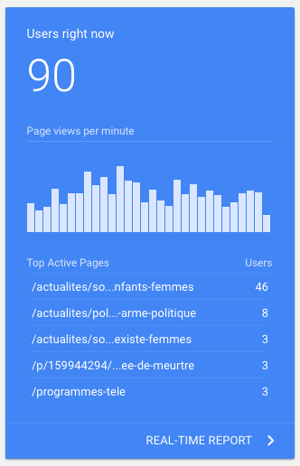

# CSS INTEGRATION 

## Interface 2

During this exercise we had to recreate a view pixel-perfectly. 

## Motivation 

This exercise was meant for us to see how much we learned and how far we have came on our web development journey from the start of the training. As this was a mock test, we were not allowed to ask for help from our fellow juniors.

## View example

The view we had to recreate:

